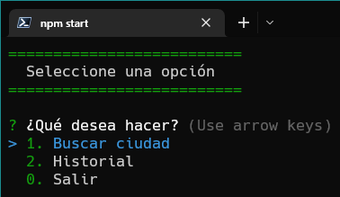
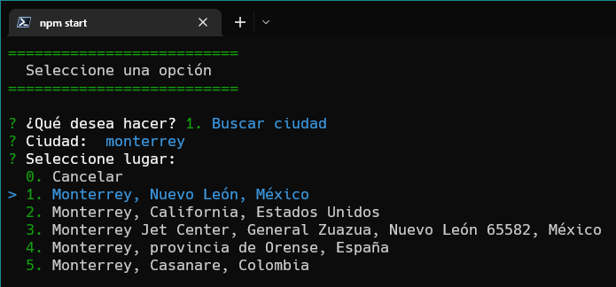
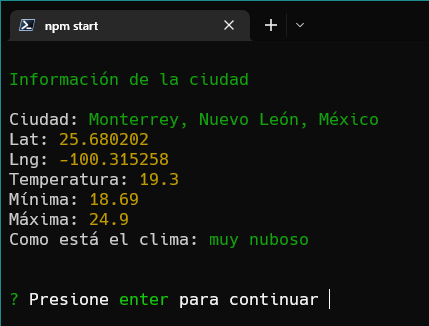
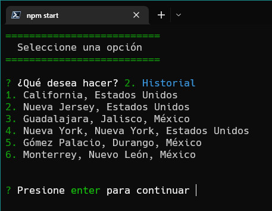

# Aplicación de Clima
Aplicación en consola para revisar la temperatura de diversas ciudades haciendo peticiones a las API's ```Mapbox Search API``` y ```Open Weather```

# Uso
Reconstruir los módulos de node con el comando
```npm install```

Iniciar aplicación con el comando ``` npm start ```

# Capturas




